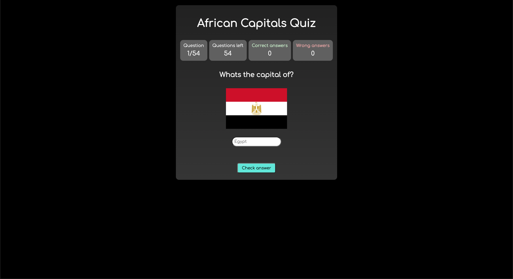

# African Capitals Quiz

## Created by

- Karl Gunnarsson (<https://github.com/KG416>)

## Motivation

A quiz I did for fun and also to practice my vanilla Javascript.

## Type of project
Game (quiz)

## Concept/rules
You are given the name and the flag of the country. Your objective is to write the name of the capital.

## Screenshots

